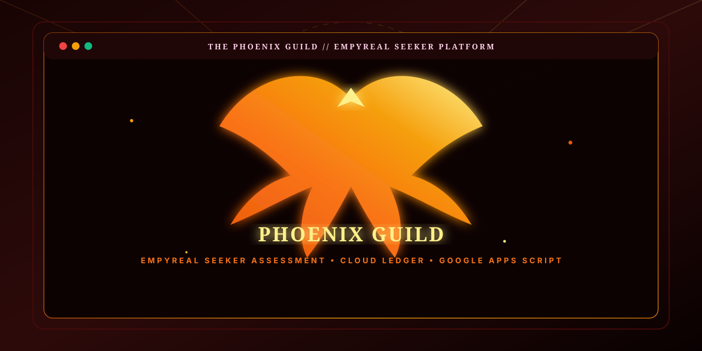
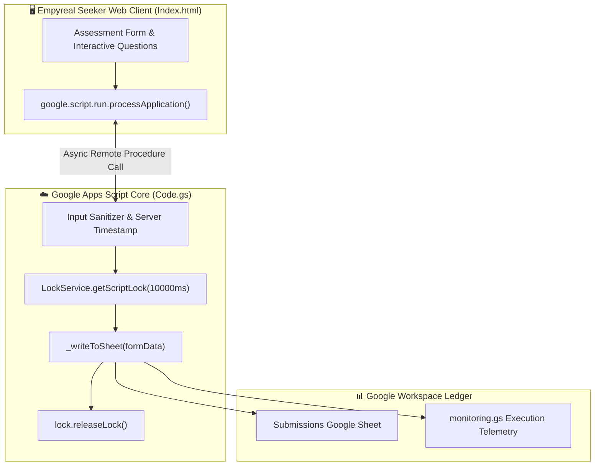

<!-- 🔥 PHOENIX GUILD BACKEND — REPOSITORY PRESENTATION (L3 SHOWCASE) -->

<div align="center">



# **🔥 Phoenix Guild Backend**

**An immersive quest assessment web platform, concurrency-safe application processor, and cloud ledger pipeline built with Google Apps Script HtmlService and V8.**

[](#-core-features)
[](appsscript.json)
[](.clasp.json)
[](#-concurrency-locking--security)
[](LICENSE)
[](https://github.com/traikdude/phoenix-guild-backend)

<p align="center">
  <a href="#-overview"><b>Overview</b></a> •
  <a href="#-core-features"><b>Features</b></a> •
  <a href="#-concurrency-locking--security"><b>Security</b></a> •
  <a href="#-architecture"><b>Architecture</b></a> •
  <a href="#-quick-start--clasp"><b>Quick Start</b></a> •
  <a href="#-contributing"><b>Contributing</b></a> •
  <a href="#-license"><b>License</b></a>
</p>

</div>

---

## 📑 Table of Contents

- [✨ Overview](#-overview)
- [🚀 Core Features](#-core-features)
  - [1. Immersive Guild Onboarding Experience (`Index.html`)](#1-immersive-guild-onboarding-experience-indexhtml)
  - [2. Concurrency-Safe Ledger Pipeline (`Code.gs`)](#2-concurrency-safe-ledger-pipeline-codegs)
  - [3. Dual RPC & REST Ingestion Endpoints](#3-dual-rpc--rest-ingestion-endpoints)
  - [4. Automated Health Monitoring & Telemetry](#4-automated-health-monitoring--telemetry)
- [🛡️ Concurrency Locking & Security](#-concurrency-locking--security)
- [🏗️ Architecture & Component Flow](#-architecture--component-flow)
- [🛠️ Tech Stack](#-tech-stack)
- [⚡ Quick Start & Clasp Deployment](#-quick-start--clasp-deployment)
- [🗂️ Repository Structure](#-repository-structure)
- [🤝 Contributing](#-contributing)
- [📄 License](#-license)

---

## ✨ Overview

**Phoenix Guild Backend** powers the **Empyreal Seeker Assessment**, a gamified guild onboarding web app and candidate submission engine.

Built with **Google Apps Script V8**, **HtmlService**, and **Google Sheets**, the backend handles client-side form submissions asynchronously (`google.script.run`), verifies input integrity, enforces concurrency mutex locking via `LockService` to eliminate race conditions, and persists applications directly into structured spreadsheet ledgers.

---

## 🚀 Core Features

```mermaid
mindmap
  root((🔥 Phoenix Guild))
    ⚔️ Quest UI
      365KB+ Single-Page Client
      Cinzel & Fiery Theme
      Multi-Step Guild Questions
    ☁️ Apps Script Core
      HtmlService WebApp
      Asynchronous processApplication()
      Legacy doPost() Webhook
    🛡️ Concurrency & Safety
      LockService Mutex Locking
      Server-Side Timestamps
      Input Sanitization
    📊 Ledger Store
      Google Sheets Submissions Tab
      Execution Monitoring & Logs
```

### 1. Immersive Guild Onboarding Experience (`Index.html`)
365KB+ self-contained responsive client providing a gamified assessment interface with interactive scoring and animations.

### 2. Concurrency-Safe Ledger Pipeline (`Code.gs`)
Utilizes Google Apps Script `LockService.getScriptLock()` with a 10-second timeout to prevent data collision during simultaneous submissions.

### 3. Dual RPC & REST Ingestion Endpoints
Supports interactive client-side execution via `google.script.run` as well as headless automated submissions via standard HTTP POST (`doPost`).

### 4. Automated Health Monitoring & Telemetry
Monitors backend execution times, lock contention, and submission counts via [`monitoring.gs`](monitoring.gs).

---

## 🛡️ Concurrency Locking & Security

* 🔒 **Mutex Locking**: `LockService.getScriptLock()` guarantees single-threaded spreadsheet writes under heavy submission bursts.
* 🛡️ **Anti-Spoofing Timestamps**: Enforces server-side UTC timestamps (`new Date().toISOString()`) rather than trusting client clocks.
* 🧹 **Input Sanitization**: Rejects empty payloads and trims string inputs before writing to Google Sheets.

---

## 🏗️ Architecture & Component Flow



---

## 🛠️ Tech Stack

* **Platform**: Google Apps Script JavaScript V8 (`Code.gs`, `appsscript.json`)
* **Frontend**: Responsive Single-Page Application (`Index.html`, 365KB+)
* **Database / Store**: Google Sheets (`SpreadsheetApp`)
* **DevOps**: `@google/clasp` deployment pipeline

---

## ⚡ Quick Start & Clasp Deployment

### Prerequisites
* [Node.js](https://nodejs.org/) (v18+)
* [@google/clasp](https://www.npmjs.com/package/@google/clasp)

### Setup Instructions
1. Clone the repository:
   ```bash
   git clone https://github.com/traikdude/phoenix-guild-backend.git
   cd phoenix-guild-backend
   ```
2. Login to Google Apps Script:
   ```bash
   clasp login
   ```
3. Push changes:
   ```bash
   clasp push
   ```
4. Open the deployed web app:
   ```bash
   clasp open --webapp
   ```

---

## 🗂️ Repository Structure

```text
phoenix-guild-backend/
├── docs/                        # Presentation & visual assets
│   └── assets/
│       └── banner.svg           # L3 Showcase high-resolution vector hero banner
├── Index.html                   # 365KB+ Gamified quest assessment web client
├── Code.gs                      # Core Apps Script backend & LockService handlers
├── monitoring.gs                # Telemetry logger & submission metrics
├── appsscript.json              # Apps Script manifest & scopes
├── .clasp.json                  # Google Apps Script project binding
├── README.md                    # L3 Showcase presentation documentation
└── LICENSE                      # MIT Open Source License
```

---

## 🤝 Contributing

1. Fork the repository and create your feature branch (`git checkout -b feature/new-assessment-question`).
2. Update questions in `Index.html` or ledger schemas in `Code.gs`.
3. Test locally and deploy with `clasp push`.
4. Submit a Pull Request.

---

## 📄 License

Distributed under the **MIT License**. See [LICENSE](LICENSE) for details.

---

<div align="center">

*Forged for Guild Members, Gamified Onboarding & Sovereign AI Agents.*  
**Phoenix Guild Backend · Google Apps Script · HtmlService · LockService**

</div>
